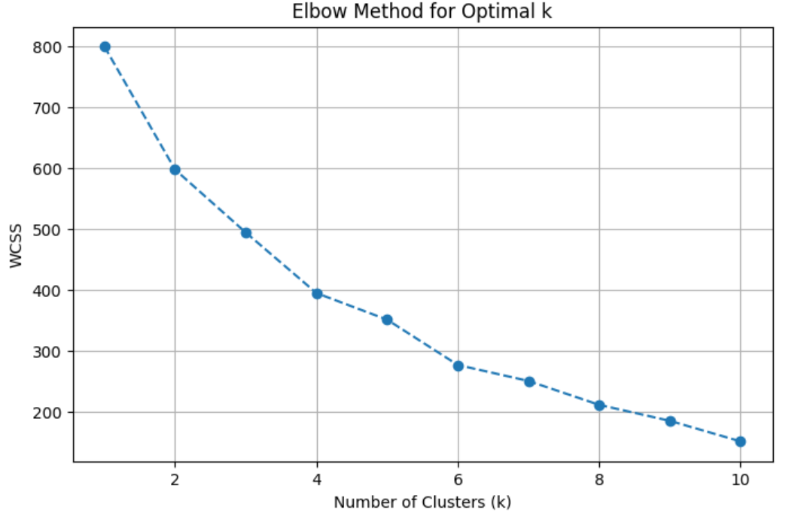
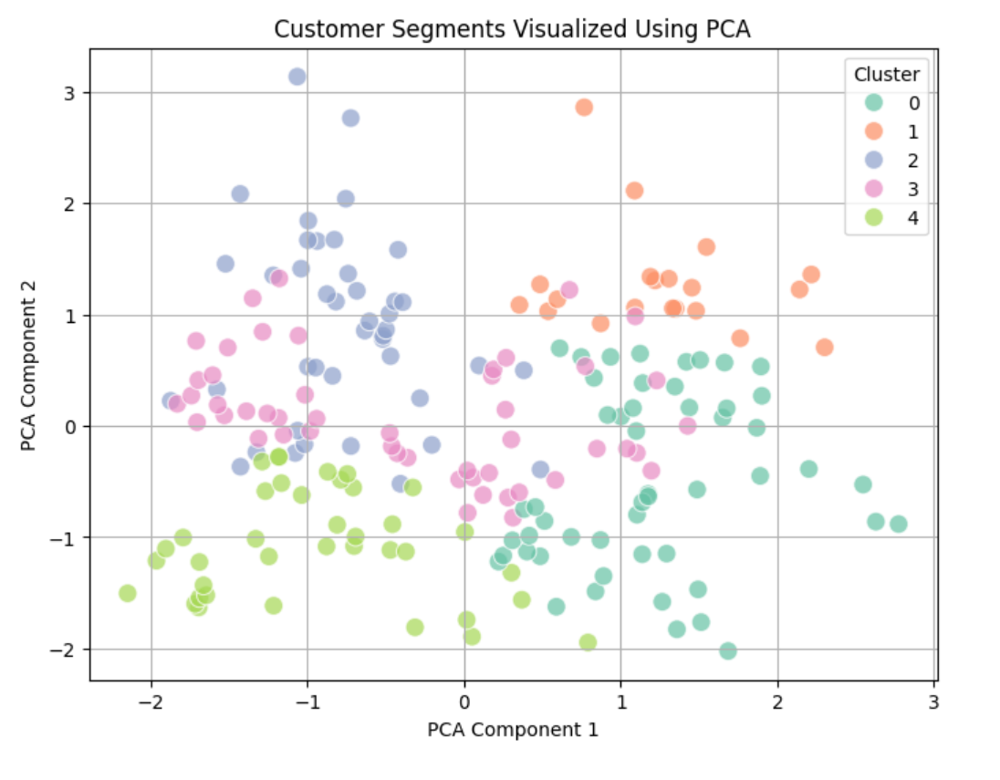
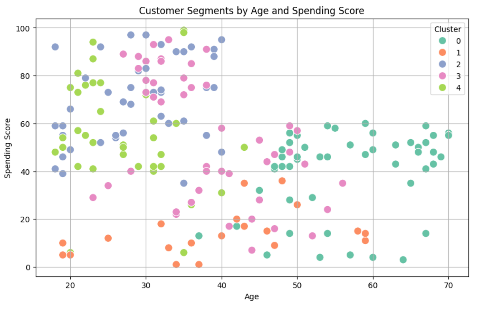
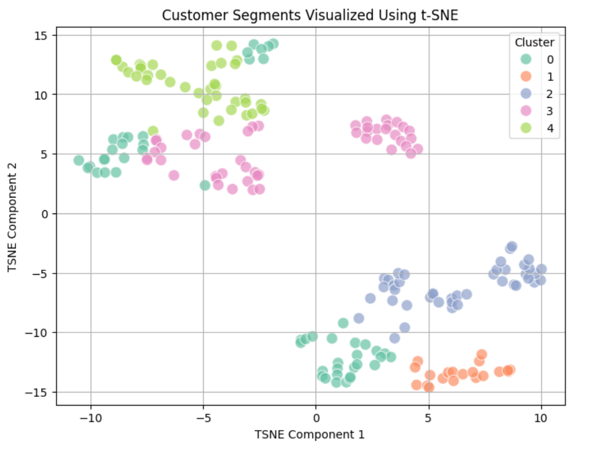

# 🛍️ Mall Customer Segmentation using K-Means Clustering

[](https://www.kaggle.com/datasets/amisha0528/mall-customers-dataset)
[](https://colab.research.google.com/github/M-Z-5474/mall-customer-segmentation/blob/main/data-analysis/mall_customers_segmentation.ipynb)


This project performs **customer segmentation** on mall customer data using **unsupervised machine learning** (K-Means Clustering). The goal is to identify distinct customer groups based on demographics and spending behavior to help with **targeted marketing** and **personalized business strategies**.

---

## 📁 Project Structure

```

📁 dataset/           → Raw data file (Mall\_Customers.csv)
📁 data-analysis/     → Jupyter/Colab notebook for EDA & clustering
README.md             → Main project overview (you are here)

```

---

## 📦 Dataset Information

- **Source**: [Kaggle - Mall Customers Dataset](https://www.kaggle.com/datasets/amisha0528/mall-customers-dataset)
- **Records**: 200 customers
- **Features**: CustomerID, Gender, Age, Annual Income (k$), Spending Score (1–100)
- **No missing values**

---

## 🔍 What’s Inside the Analysis

The notebook in `data-analysis/` performs the following tasks:

- 🔹 Data Cleaning & Encoding  
- 🔹 Exploratory Data Analysis (EDA)  
- 🔹 Feature Scaling using `StandardScaler`  
- 🔹 K-Means Clustering with Elbow Method  
- 🔹 PCA & t-SNE Visualizations  
- 🔹 Silhouette Score Evaluation  
- 🔹 Cluster-Based Marketing Strategy Suggestions

### 🖼️** Key Visualizations**
### 📌 Elbow Method for Optimal Clusters


### 📌 Final Customer Segments (PCA)


### 📌 Age vs Spending Score


### 📌 Customer Segments Visualized Using t-SNE


---

## 📈 Key Techniques Used

| Category         | Tools & Libraries                      |
|------------------|----------------------------------------|
| Data Handling    | `pandas`, `numpy`                      |
| Visualization    | `matplotlib`, `seaborn`                |
| Clustering       | `scikit-learn` (KMeans, PCA, t-SNE)    |
| Evaluation       | `silhouette_score`                     |

---

## 📌 Objective

Group mall customers into clusters based on:
- **Age**
- **Annual Income**
- **Spending Score**
- **Gender**

Then interpret these clusters to design **personalized marketing strategies**.

---

## 📬 Author

**Muhammad Zain Mushtaq**  
📌 GitHub: [@M-Z-5474](https://github.com/M-Z-5474)

---

> 💡 Tip: Explore the `data-analysis` folder for the complete interactive notebook and detailed clustering insights.


